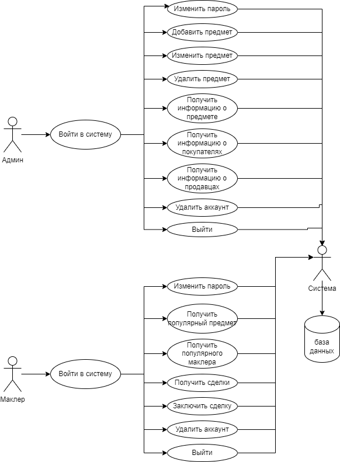

# Функциональные требования

[Home](../index.md)    
[Функциональные требования](functionalrequirements.md)  
[Диаграмма файлов приложения](filediagram.md)   
[Схема базы данных](databaseSchema.md)  

# Функциональные требования

#### Приложение должно позволять пройти аутентификацию и авторизацию.

#### Приложение должно выполнять следующие функции:

#### 1. Запросы на получение информации
- **Проданное количество и общая стоимость товаров**:
    - По каждому названию товара – информация о проданном количестве и общей стоимости за указанный период.

- **Сведения о покупателях**:
    - По каждому названию товара – перечень фирм-покупателей с указанием количества единиц и стоимости купленного ими товара.

- **Анализ наиболее востребованных товаров**:
    - По виду товара, пользующемуся наибольшим спросом – сведения о количестве и стоимости проданного товара по каждой фирме-покупателю.

- **Информация о маклерах**:
    - По маклеру, совершившему максимальное количество сделок – сведения о нем и фирмах-поставщиках.

- **Информация о фирмах-поставщиках**:
    - По каждой фирме-поставщику – список маклеров с указанием количества и стоимости проданного ими товара по каждому маклеру.

#### 2. Обновление информации
- **Вставка новых данных**:
    - Добавление новых маклеров, товаров и сделок в соответствующие таблицы.

- **Обновление существующих данных**:
    - Обновление информации о маклерах, товарах и сделках.

- **Удаление данных**:

#### 4. Обновление статистики маклеров
- **Функция обновления статистики маклеров**:
    - При совершении новой сделки обновление сведений о количестве проданных единиц и сумме сделки в специальной таблице статистики.

#### 5. Управление данными о товарах

#### 6. Получение информации о сделках

### Use Case диаграмма:

Для разработки use-case диаграммы, можно рассмотреть следующие сценарии использования для администратора и маклера в системе «Парфюмерный базар».

### Сценарии использования для администратора
1. Администратор вводит логин и пароль.
2. После подтверждения логина и пароля система отображает меню.
3. Администратор выбирает одну из следующий опций:
 - Change password 
 - Add item 
 - Update item amount 
 - Delete item 
 - Get item info 
 - Get firm info about item 
 - Get firm seller info 
 - Remove account 
 - Exit
4. Администратор выбирает пункт меню

### Сценарии использования для маклера
1. Маклер вводит логин и пароль.
2. После подтверждения логина и пароля система отображает меню.
3. Маклер выбирает одну из следующий опций:
- Change password 
- Get popular item info 
- Get successful makler info 
- Get bargains 
- Make bargain 
- Remove account 
- Exit
4. Маклер выбирает пункт меню